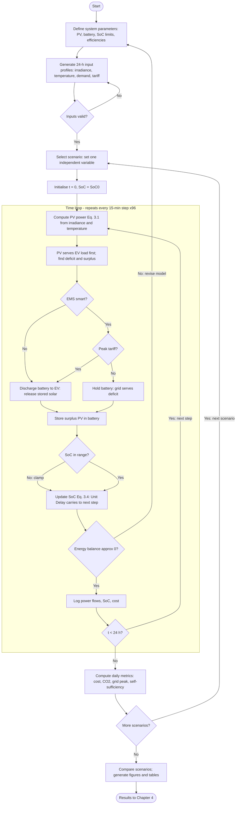

# Chapter 3: Methodology

> **Draft (v2) for the final thesis — "Smart Solar-Driven Energy Management for EV Charging Stations".**
> Updated to include a detailed project flow chart in Section 3.1. Written to be descriptive so
> you can trim. Every technical claim is tied to a source that has been verified (full list at
> the end); in-text citations use Harvard style. Items in **[square brackets]** are notes/
> placeholders for you to action (insert the figure, confirm a number) — delete them before
> submission.

This chapter explains how the smart solar-driven energy management system (EMS) for an electric
vehicle (EV) charging station was modelled, simulated and analysed. The work was carried out as
a numerical study in MATLAB/Simulink, in which a photovoltaic (PV) array, a battery energy
storage system (BESS), a grid connection and an EV charging load are coordinated by a rule-based
controller under a time-of-use electricity tariff. The chapter first presents the overall
project flow (Section 3.1), then the detailed modelling procedure, equations and parameters
(Section 3.2), and finally the data and resources used (Section 3.3). The methodology is built
around a *controlled, one-variable-at-a-time* experimental design so that the effect of each
input on charging-station performance can be isolated and measured, which directly shapes the
structure of the results in Chapter 4.

---

## 3.1 Overview of Project Flow Chart

The project followed a staged workflow that moves from data preparation, through model
construction and a validated simulation loop, to controlled experiments and analysis. Rather
than a simple linear sequence, the workflow contains two validation gates, the controller's
decision logic, and two nested repetition loops; capturing these explicitly makes the
simulation logic transparent and is what allows each result in Chapter 4 to be traced back to a
specific step. The complete flow is shown in **[Figure 3.1]** and is described below.

The workflow begins by **defining the system parameters** (PV rating, battery capacity, state-of-
charge limits and efficiencies) and **generating the 24-hour input profiles** for irradiance,
temperature, EV demand and tariff at a 15-minute resolution. A first decision gate, *"inputs
valid?"*, checks that these profiles are physically reasonable (for example, PV generation is
zero overnight and the demand profile overlaps the evening peak); if not, the profiles are
regenerated before the model is run.

Once the inputs are accepted, the model **selects a scenario** by setting a single independent
variable, **initialises** the simulation clock and the battery state of charge, and then enters
the **per-step time loop**, which repeats for every 15-minute interval across the day (96 steps).
Within each step the model: (i) computes the available PV power from irradiance and temperature
(Equation 3.1); (ii) supplies the EV load from PV first and determines the remaining deficit and
any surplus; and (iii) passes the situation to the controller. The controller is represented by
two nested decision diamonds — *"EMS smart?"* and, if so, *"peak tariff?"* — which together
decide whether the battery discharges to support the load or is held in reserve (Section 3.2.1
explains this logic in full). Spare PV is then stored in the battery, the state of charge is
checked against its limits and updated (Equation 3.4), and a second validation gate, *"energy
balance ≈ 0?"*, confirms that supply equals demand at that step (Equation 3.5) before the power
flows are logged. A *"t < 24 h?"* decision returns the model to the start of the loop until the
day is complete.

After the day has been simulated, the model **computes the daily performance metrics** (cost,
CO₂ avoided, peak grid power and solar self-sufficiency). A final *"more scenarios?"* decision
forms the **outer loop**: control returns to scenario selection so that the next controlled
experiment can be run with one input changed. When all scenarios are complete, the results are
**compared and presented** as the figures and tables that form Chapter 4. This staged,
gated-and-looped structure reflects established practice for grid-connected PV–BESS–EV systems,
in which the modelling strategy, parameters and an explicit validation step are described before
results are reported (Saleem et al. 2024; Hermans et al. 2024).

**[Insert Figure 3.1 here.]** The flow chart below is provided as a Mermaid definition; pasting
it into a free tool such as *draw.io* or *mermaid.live* produces an editable figure you can
export for the thesis. Because the chart is tall, it reads best placed on its own **landscape**
page, or split into two linked figures (Figure 3.1a — the per-scenario simulation loop; Figure
3.1b — the experiment and analysis workflow).

---

## 3.2 Detailed Project Methodology

### 3.2.1 Methodology Approaches

The model represents one day of operation of a small grid-connected EV charging station supplied
by rooftop PV and a battery. Time is discretised into 15-minute steps over 24 hours (96 steps),
which is a practical resolution for energy-management studies of this type and matches the
decision interval used by comparable rules-based controllers (Danielsson et al. 2025). The
procedure follows the six steps below, which correspond to the boxes inside the simulation loop
of Figure 3.1.

**Step 1 — Input data preparation.** Four 24-hour profiles are generated at 15-minute resolution:
solar irradiance *G(t)* (W/m²), ambient/module temperature *T(t)* (°C), EV charging demand
*P_EV(t)* (kW), and the electricity tariff *Price(t)* (AUD/kWh). The irradiance profile is a
daytime curve that peaks near solar noon and is zero overnight; the temperature profile follows a
similar daily shape. The EV demand profile combines a daytime charging block with a larger
early-evening block, reflecting the common situation in which EV charging coincides with the
evening demand peak (Hermans et al. 2024). The tariff follows the Victorian Default Offer
time-of-use structure, which has a low-priced "solar soak" window in the middle of the day, an
off-peak overnight window, and an evening peak (Essential Services Commission 2025). The
*"inputs valid?"* gate in Figure 3.1 represents the visual check that these profiles are
physically sensible before the model is run. **[Confirm the exact c/kWh rates from your
retailer's Victorian Energy Fact Sheet and cite them; the relative ordering off-peak <
solar-soak < peak is what drives the controller.]**

**Step 2 — PV generation modelling.** The PV array output is calculated from irradiance and
temperature using a temperature-corrected linear model:

> **Equation 3.1:**  *P_PV(t) = P_rated × (G(t) / G_ref) × [1 + α (T(t) − T_ref)] × η_MPPT*

where *P_rated* is the rated PV capacity, *G_ref* = 1000 W/m² and *T_ref* = 25 °C are the
standard test conditions, *α* is the temperature coefficient of power, and *η_MPPT* is the
combined maximum-power-point-tracking and conversion efficiency. The linear temperature
correction term is the standard form reviewed by Skoplaki and Palyvos (2009), who tabulate the
common efficiency/power correlations expressing how module performance falls as temperature
rises above the reference. Representing the maximum-power-point tracker as a fixed efficiency,
rather than modelling a switching converter, keeps the model at an appropriate level of detail
for an energy-management study while still capturing the dominant dependence of PV output on
irradiance and temperature (Saleem et al. 2024). The harvested PV energy over the day is obtained
by summing power over the time steps:

> **Equation 3.2:**  *E_PV = Σ P_PV(t) · Δt*,  with Δt = 0.25 h.

**Step 3 — EV charging load.** The charging demand is treated as a known load profile derived
from the number of connected vehicles and the charger rating:

> **Equation 3.3:**  *P_EV(t) = N_EV(t) × P_charger*

where *N_EV(t)* is the number of vehicles charging at time *t* and *P_charger* is the per-charger
power. Modelling the charging demand as a controllable, time-varying load is consistent with its
treatment in grid-connected charging-station studies (Hermans et al. 2024). **[If you later add
random arrival times, cite a stochastic EV-demand source and note it as an extension.]**

**Step 4 — Battery storage and state of charge.** A battery is included because PV output is
intermittent and rarely matches the charging demand instant by instant; storage is therefore
required to improve the reliability and solar utilisation of the station (Kumar et al. 2019;
Alrubaie et al. 2023). The battery is modelled as an energy reservoir whose state of charge is
updated each step:

> **Equation 3.4:**  *SoC(t) = SoC(t−1) + (η_ch · P_ch(t) · Δt / E_cap) − (P_dis(t) · Δt / (η_dis · E_cap))*

where *E_cap* is the usable capacity, *P_ch* and *P_dis* are the charging and discharging powers,
and *η_ch*, *η_dis* are the charge/discharge efficiencies (giving a round-trip efficiency of
roughly 85%). The state of charge is constrained between a minimum and maximum (here 20% and
95%), which appears in Figure 3.1 as the *"SoC in range?"* gate that clamps the value before the
update; these limits follow the SoC bounds identified as key control variables for PV–EV energy
management (Alrubaie et al. 2023). Charge and discharge powers are also capped at a maximum rate
to keep operation realistic. Modelling the round-trip loss explicitly is important: it ensures
the simulation does not overstate the benefit of cycling energy through the battery.

**Step 5 — Energy-management controller.** The controller decides, at each step, how the EV
demand is met from PV, battery and grid. A *rule-based* strategy is used rather than an
optimisation-based one. This choice is deliberate: rules-based controllers are transparent,
computationally light and widely used for PV–BESS–EV charging stations, and a recent example
makes its dispatch decisions every 15 minutes using the energy tariff, battery state of charge
and the generation/demand situation, prioritising renewable energy to reduce cost (Danielsson et
al. 2025). The controller is shown in Figure 3.1 as the two nested decisions *"EMS smart?"* and
*"peak tariff?"*, which select between two modes:

- **Baseline mode** — solar serves the load first, spare solar charges the battery, and the
  battery is then discharged greedily to cover any remaining deficit regardless of price, with
  the grid supplying whatever is left.
- **Smart (tariff-aware) mode** — solar serves the load first and spare solar charges the battery,
  but the battery is *held* and discharged only during the peak-tariff window, so that stored
  solar energy displaces the most expensive grid imports. Outside the peak, deficits are met from
  the grid and the battery is reserved.

The smart mode therefore performs peak-shaving and tariff arbitrage with stored solar energy,
which is the mechanism by which a coordinated PV–storage–grid controller reduces charging cost
and grid stress (Cheikh-Mohamad et al. 2023; Hermans et al. 2024). **[Note for Chapter 5: the
rule-based controller is the planned model; replacing it with model predictive control (MPC) is
identified as future work, since MPC has been shown to cut grid peaks substantially in a real
grid-connected charging microgrid (Hermans et al. 2024).]**

**Step 6 — Power balance, outputs and metrics.** At every step the controller's power flows must
satisfy the energy balance, which is enforced by the *"energy balance ≈ 0?"* gate in Figure 3.1:

> **Equation 3.5:**  *P_EV(t) = P_PV→EV(t) + P_Bat→EV(t) + P_Grid→EV(t)*

The grid energy and charging cost over the day are obtained from:

> **Equation 3.6:**  *E_grid = Σ [P_Grid→EV(t) + P_Grid→Bat(t)] · Δt*
>
> **Equation 3.7:**  *Cost = Σ [P_Grid→EV(t) + P_Grid→Bat(t)] · Price(t) · Δt*

and the avoided emissions are estimated by comparing the grid energy used with a grid-only
reference and applying the grid emission factor *EF*:

> **Equation 3.8:**  *CO₂_avoided = (E_grid,only − E_grid) × EF*

The emission factor used is the Victorian Scope 2 (location-based) factor from the Australian
National Greenhouse Accounts Factors (DCCEEW 2025). **[Confirm the exact value — Victoria's
factor is reported at ≈0.78 kg CO₂-e/kWh — in the DCCEEW 2025 workbook, Table 1, and cite it.]**

### 3.2.2 Key Investigating Parameters

The key parameters are grouped into independent variables (the inputs deliberately varied in the
experiments) and dependent variables (the performance measures observed). They are chosen to link
directly to the project aim of reducing grid dependency, improving solar utilisation, lowering
charging cost and reducing emissions.

**Independent variables:** solar irradiance level (sunny vs cloudy), controller mode (baseline vs
smart), tariff structure (time-of-use vs flat), and EV demand level (low / nominal / high).

**Dependent variables:** PV energy supplied directly to EVs (kWh), battery energy supplied to EVs
(kWh), grid energy imported (kWh), peak grid power (kW), charging cost (AUD), CO₂ avoided (kg),
solar self-sufficiency (%), and the battery SoC trajectory.

The dependent variables are computed from the logged power flows using Equations 3.2 and 3.5–3.8;
solar self-sufficiency is the share of total EV demand met by PV directly plus solar energy
delivered via the battery (because, in this model, the battery is charged only from PV, this
share is unambiguous). Each independent variable is investigated by changing it alone while
holding the others fixed — the "select scenario" step in Figure 3.1 — and the dependent variables
are then compared across the two settings to quantify the effect. The planned mapping of
independent to dependent variables is shown in Table 3.1.

**Table 3.1 — Parametric analysis plan.**

| Independent variable | | Dependent variable(s) observed |
|---|---|---|
| Solar irradiance (sunny vs cloudy) | vs | PV-to-EV energy, grid import, CO₂ avoided |
| Controller mode (baseline vs smart) | vs | Charging cost, peak grid power, self-sufficiency |
| Tariff structure (time-of-use vs flat) | vs | Charging cost, battery dispatch timing (SoC trace) |
| EV demand level (low / nominal / high) | vs | Grid import, solar self-sufficiency |

### 3.2.3 Design of Experiment (DoE)

The experiment uses a one-factor-at-a-time design: a single base case is established, and each
study then changes exactly one independent variable while all other inputs and parameters are
held constant. This isolates the effect of each factor and avoids the confounding that occurs
when several conditions change together. The same parametric approach — running a MATLAB/Simulink
solar EV-charging model under separate irradiance conditions to observe the effect on performance
— has been applied in recent work on solar-integrated EV charging ([Scientific Reports 2025]).
The base case is a sunny day with the nominal EV demand profile, the time-of-use tariff and the
smart controller enabled. The four studies, which become Sections 4.1–4.4 of the results and
which the outer loop of Figure 3.1 generates in turn, are summarised in Table 3.2.

**Table 3.2 — Design of experiment: inputs and outputs.**

| Study | Input parameter changed | Output parameters measured |
|---|---|---|
| 4.1 Irradiance | Sunny → Cloudy (others fixed, smart ON) | PV-to-EV, grid import, CO₂ avoided |
| 4.2 Controller | Smart OFF → Smart ON (sunny, nominal demand, ToU) | Cost, peak grid power, self-sufficiency |
| 4.3 Tariff | Time-of-use → Flat (sunny, smart ON) | Cost, SoC dispatch timing |
| 4.4 Demand | Low → Nominal → High (sunny, smart ON, ToU) | Grid import, self-sufficiency |

Study 4.2 is the central comparison of the thesis: because only the controller mode changes —
the *"EMS smart?"* branch in Figure 3.1 — any difference in cost or peak grid power can be
attributed to the controller itself.

### 3.2.4 Validation Approach

As a simulation study, the model is validated by internal consistency checks and by comparison
with the literature rather than by hardware measurement. The two validation gates in Figure 3.1
formalise the first two of the three checks below. First, the instantaneous energy balance
(Equation 3.5) is evaluated at every time step — the *"energy balance ≈ 0?"* gate — and the
maximum absolute imbalance across the day is reported and required to be effectively zero, which
confirms that no energy is created or lost in the power-flow accounting; a failure returns the
workflow to revise the model. Second, the battery SoC trajectory is checked against its limits
(20%–95%) at the *"SoC in range?"* gate, confirming the storage model never operates outside the
allowed range. Third, the *direction and plausibility* of the results are compared with published
findings: a coordinated controller is expected to reduce peak grid power and increase the share
of demand met by solar, consistent with the grid-peak reductions reported for a real
grid-connected charging microgrid (Hermans et al. 2024) and with the cost-reduction role of
tariff-aware dispatch (Cheikh-Mohamad et al. 2023; Danielsson et al. 2025). **[After running the
model, report your actual energy-balance error and SoC range here, and state how your
peak-reduction result compares in direction with Hermans et al. (2024).]**

---

## 3.3 Methodology: Data and Resources

The resources required for the project are summarised in Table 3.3. The study is software-based
and uses no physical equipment, which is appropriate for a modelling and simulation thesis at
this stage.

**Table 3.3 — Resource breakdown.**

| Resource breakdown | Resource type and source | Availability |
|---|---|---|
| Facilities and data | 24-h profiles for irradiance, temperature, EV demand; time-of-use tariff (Victorian Default Offer, Essential Services Commission 2025); grid emission factor (DCCEEW 2025) | Yes |
| Equipment and materials | None (numerical simulation only) | Yes |
| Software | MATLAB/Simulink R2026a (PV, battery, EMS model, logging, post-processing) | Yes |
| Personnel | Student (modelling, simulation, analysis); academic advisor (guidance) | Yes |
| Others | Published literature for model justification and benchmarking | Yes |

The choice of MATLAB/Simulink as the platform follows its established use for PV–BESS–EV
charging-station modelling (Kumar et al. 2019; Saleem et al. 2024). All input data are either
generated as representative 24-hour profiles or sourced from the Australian references above;
where representative values are used (for example the exact tariff rates), this is stated so that
the model can be re-run with site-specific data without changing its structure.

---

## How this chapter connects to the rest of the thesis

- **Chapter 1 (objectives/research questions):** Section 3.1 maps the workflow onto your
  objectives; Table 3.1 ties each independent variable to the aim (grid dependency, solar
  utilisation, cost, emissions). Word your objectives so each one is answered by one study in
  Table 3.2.
- **Chapter 2 (literature/gaps):** every modelling choice here cites a paper from your review, so
  your "research gap" (e.g. limited isolation of the controller's contribution; rule-based vs
  MPC) should foreshadow the controlled DoE in 3.2.3.
- **Chapter 4 (results):** Sections 4.1–4.4 are exactly the four studies in Table 3.2, reported
  with the dependent variables in Table 3.1 and the equations in 3.2.1; the two validation gates
  in Figure 3.1 give you the energy-balance and SoC checks to report.
- **Chapter 5 (conclusions/recommendations):** the MPC upgrade flagged in Step 5 and the
  hardware/stochastic extensions become your recommendations.

---

## References cited in this chapter (verified — Harvard)

Alrubaie, A.J., Salem, M., Yahya, K., Mohamed, M. & Kamarol, M. 2023, 'A comprehensive review of
electric vehicle charging stations with solar photovoltaic system considering market, technical
requirements, network implications, and future challenges', *Sustainability*, vol. 15, no. 10,
8122.

Cheikh-Mohamad, S., Celik, B., Sechilariu, M. & Locment, F. 2023, 'PV-powered charging station
with energy cost optimization via V2G services', *Applied Sciences*, vol. 13, no. 9, 5627.

Danielsson, G.H., da Silva, L.N.F., da Paixão, J.L., Abaide, A.d.R. & Neto, N.K. 2025,
'Rules-based energy management system for an EV charging station nanogrid: a stochastic analysis',
*Energies*, vol. 18, no. 1, 26.

Department of Climate Change, Energy, the Environment and Water (DCCEEW) 2025, *Australian
National Greenhouse Accounts Factors 2025*, Australian Government, Canberra. **[Confirm Table 1
Victorian Scope 2 factor.]**

Essential Services Commission 2025, *Victorian Default Offer* [time-of-use price structure], State
Government of Victoria. **[Confirm the determination year and exact rates you cite.]**

Hermans, B.A.L.M., Walker, S., Ludlage, J.H.A. & Özkan, L. 2024, 'Model predictive control of
vehicle charging stations in grid-connected microgrids: an implementation study', *Applied
Energy*, vol. 368, 123210.

Kumar, V., Teja, V.R., Singh, M. & Mishra, S. 2019, 'PV based off-grid charging station for
electric vehicle', *IFAC-PapersOnLine*, vol. 52, no. 4, pp. 276–281.

Saleem, M.I., Saha, S., Izhar, U. & Ang, L. 2024, 'A stochastic MPC-based energy management system
for integrating solar PV, battery storage, and EV charging in residential complexes', *Energy and
Buildings*, vol. 325, 114993.

Skoplaki, E. & Palyvos, J.A. 2009, 'On the temperature dependence of photovoltaic module
electrical performance: a review of efficiency/power correlations', *Solar Energy*, vol. 83, no.
5, pp. 614–624.

**[Scientific Reports 2025]** — 'Development of a solar-integrated energy management system for
grid-to-vehicle and vehicle-to-grid power exchange', *Scientific Reports*, 2025. **[Complete the
author list and article number from the journal page before citing; used here as a precedent for
the parametric/one-factor-at-a-time MATLAB/Simulink approach.]**
